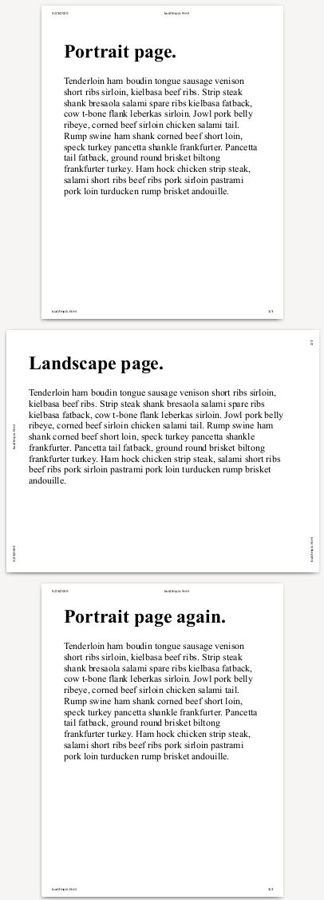

# CSS paged media page-orientation descriptor

The page-orientation descriptor can be used to set the orientation of a named page, so that it appears rotated in print preview, and also when saving paginated layout to file (e.g. PDF). Page orientation does not affect layout; any rotation is applied after layout.

The Paged Media spec has a ['size'](https://www.w3.org/TR/css-page-3/#page-size-prop) descriptor, which can also be used to set the orientation of a page indirectly, but this also affects layout. The new page-orientation descriptor is different, in that it just rotates all the layout, including any headers and footers. Printed pages may be presented together as a pamphlet or book, which essentially means that every page has the same size, and that the reader is supposed to turn the book or pamphlet 90 degrees when reading rotated pages. External formatting systems, such as word processors, may do page layout on their own and even push the output to a CANVAS, rather than individual DOM nodes. Such web-based word processors can also often support page sizings that are more advanced or specialized than what the user agent is capable of providing.

The page-orientation descriptor is defined [here](https://drafts.csswg.org/css-page-3/#page-orientation-prop). It was discussed [here](https://github.com/w3c/csswg-drafts/issues/4491).

## Example

```html
<!DOCTYPE html>
<style>
  @media print {
      @page {
	  size: portrait;
      }
      @page rotated {
	  page-orientation: rotate-left;
      }
      div {
	  overflow: hidden;
      }
      body {
	  margin: 0;
	  font-size: 2em;
      }
      .landscape {
	  page: rotated;
	  transform-origin: top left;
	  transform: translateX(100vw) rotate(90deg);
	  width: 100vh;
	  height: 100vw;
      }
  }
</style>
<div>
  <h1>Portrait page.</h1>
  <p>Tenderloin ham boudin tongue sausage venison short ribs sirloin,
    kielbasa beef ribs. Strip steak shank bresaola salami spare ribs
    kielbasa fatback, cow t-bone flank leberkas sirloin. Jowl pork
    belly ribeye, corned beef sirloin chicken salami tail. Rump swine
    ham shank corned beef short loin, speck turkey pancetta shankle
    frankfurter. Pancetta tail fatback, ground round brisket biltong
    frankfurter turkey. Ham hock chicken strip steak, salami short
    ribs beef ribs pork sirloin pastrami pork loin turducken rump
    brisket andouille.</p>
</div>
<div class="landscape">
  <h1>Landscape page.</h1>
  <p>Tenderloin ham boudin tongue sausage venison short ribs sirloin,
    kielbasa beef ribs. Strip steak shank bresaola salami spare ribs
    kielbasa fatback, cow t-bone flank leberkas sirloin. Jowl pork
    belly ribeye, corned beef sirloin chicken salami tail. Rump swine
    ham shank corned beef short loin, speck turkey pancetta shankle
    frankfurter. Pancetta tail fatback, ground round brisket biltong
    frankfurter turkey. Ham hock chicken strip steak, salami short
    ribs beef ribs pork sirloin pastrami pork loin turducken rump
    brisket andouille.</p>
</div>
<div>
  <h1>Portrait page again.</h1>
  <p>Tenderloin ham boudin tongue sausage venison short ribs sirloin,
    kielbasa beef ribs. Strip steak shank bresaola salami spare ribs
    kielbasa fatback, cow t-bone flank leberkas sirloin. Jowl pork
    belly ribeye, corned beef sirloin chicken salami tail. Rump swine
    ham shank corned beef short loin, speck turkey pancetta shankle
    frankfurter. Pancetta tail fatback, ground round brisket biltong
    frankfurter turkey. Ham hock chicken strip steak, salami short
    ribs beef ribs pork sirloin pastrami pork loin turducken rump
    brisket andouille.</p>
</div>
```


